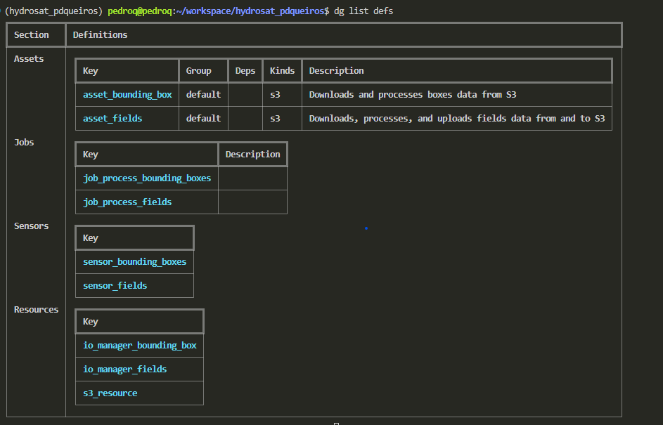
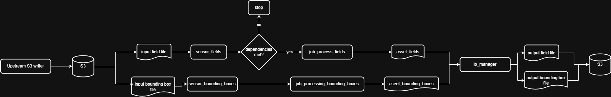
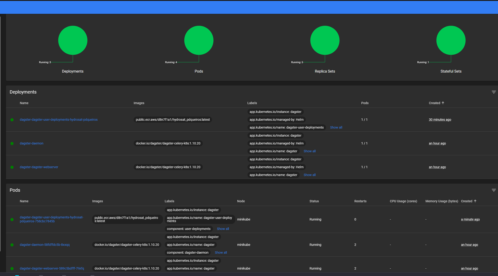
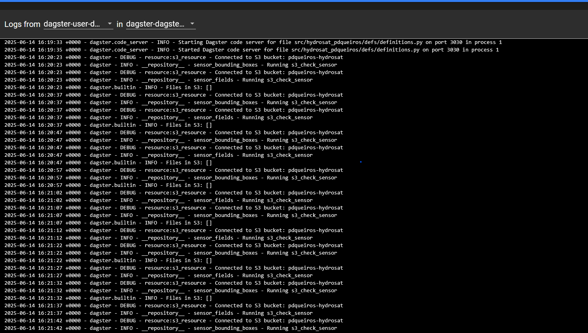
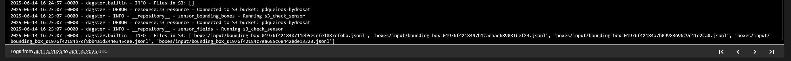
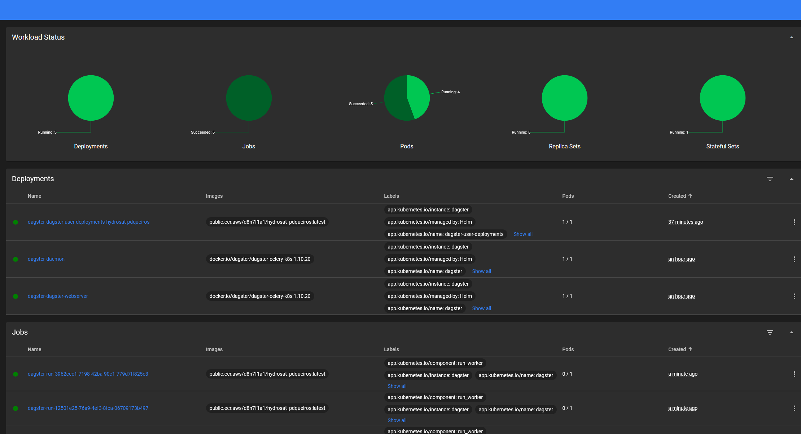
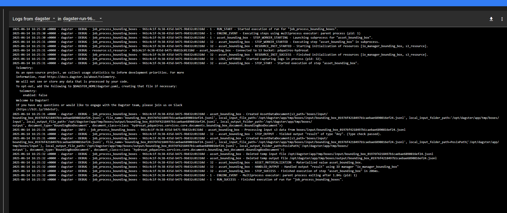
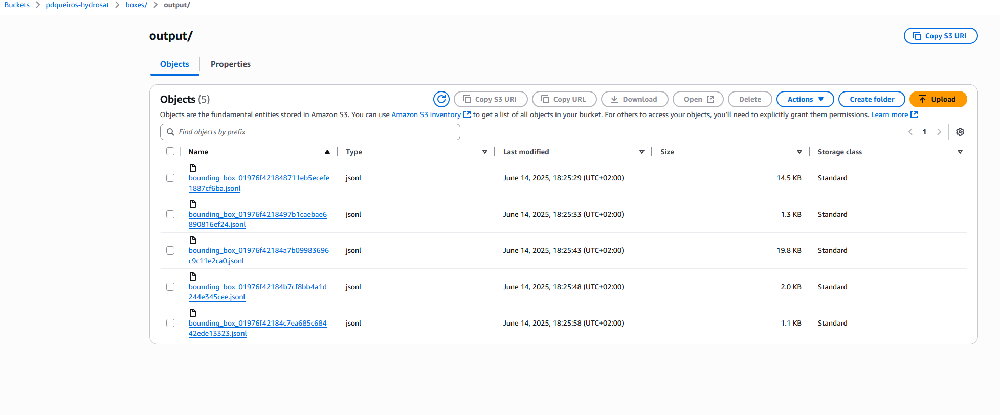
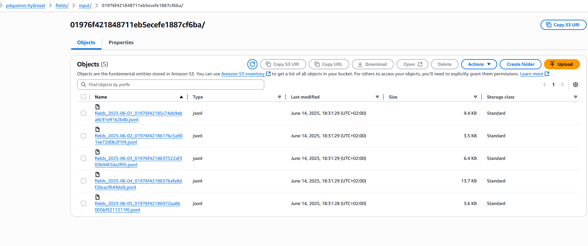
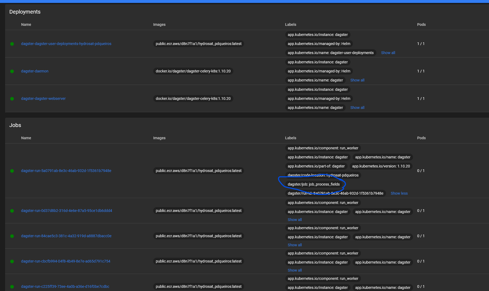

# Description

Tools used
- S3
- Dagster for orchestration
- K8s for pod deployment
- Terraform for infrastructure creation

Auto-scaling is enabled based on CPU usage, but likely it would be auto-scaled based on queue size, number of incoming requests, etc

Lechat and chatgpt was used for support on the syntax of the various tools


## Requirements

- Dagster with k8s for scheduling and data processing
- Daily data that is split into partitions.
- Each partition is dependent on the preceeding day.
- Files should be read and written to S3 bucket (e.g., AWS)

### Task description

Data shall have daily partitions, where each partition depends on the partition of the preceding day. Further, it shall read asset inputs from and write asset outputs to a configurable S3 bucket (or an equivalent of the latter).

The asset logic should account for the following aspects:

- Asset inputs:
    - A square/rectangular bounding box, which acts as the processing extent for any geospatial operation
    - Multiple “fields”, represented as polygons, which intersect with the bounding box and have different planting dates

- Processing:
    - The asset should download or simulate any data of choice and process it within the extent of the bounding box. It shall provide some output values obtained on the field extent for each of the fields, starting at the field’s planting date.

- Asset output:
    - The asset output should be one or multiple files containing the output values per field per daily partition

- Complication:
    - Assume that some field data arrives late, e.g. because they were entered late inthe system. This means that the asset’s processing status has reached timepointt, but the field should have been processed at timepoint t-2. How to handle this situation without reprocessing the entire bounding box?

# Workflow


## General workflow



```python
defs = Definitions(
    assets=[asset_bounding_box, asset_fields],
    jobs=[job_process_fields, job_process_bounding_boxes],
    sensors=[sensor_fields, sensor_bounding_boxes],
    resources={
        "s3_resource": s3_resource,
        "io_manager_fields": io_manager_fields,
        "io_manager_bounding_box": io_manager_bounding_box,
    },
)
```




The sensor for the fields has a few dependencies, as per the requirements:

- bounding box needs to be processed (currently by box id)
- previous field data is processed
- field date falls within partition start date

The bounding box processing has no dependencies.


## Data format

Data is in jsonl format, both fields and bounding boxes have the same type of data, we just process them internally in a different manner.
Bounding box:
```
{"boxId": "01976dbcbdb77dc4b9b61ba545503b77", "coordinatesXMin": 97, "coordinatesYMin": 28, "coordinatesXMax": 112, "coordinatesYMax": 42, "irrigationgArray": [[1, 1, 0, 1, 1, 1, 1, 1, 1, 1, 1, 1, 1, 0, 1], [1, 0, 0, 1, 0, 0, 1, 0, 0, 0, 1, 0, 1, 0, 1], [1, 1, 1, 0, 1, 0, 0, 1, 0, 0, 1, 0, 1, 0, 0], [0, 1, 0, 1, 1, 0, 1, 1, 1, 0, 0, 0, 0, 1, 0], [1, 1, 1, 1, 1, 1, 1, 1, 0, 1, 0, 0, 1, 1, 1], [1, 1, 0, 1, 1, 0, 1, 1, 1, 0, 0, 0, 0, 1, 1], [1, 1, 1, 1, 0, 1, 1, 0, 1, 0, 0, 1, 0, 1, 1], [0, 1, 0, 0, 1, 0, 0, 1, 0, 1, 0, 1, 0, 1, 1], [0, 1, 1, 0, 0, 1, 1, 1, 1, 0, 1, 0, 0, 0, 1], [1, 1, 1, 0, 0, 1, 0, 1, 1, 0, 1, 1, 0, 1, 1], [1, 0, 1, 0, 1, 1, 1, 0, 0, 0, 1, 0, 1, 1, 1], [1, 1, 1, 1, 0, 0, 1, 1, 1, 0, 0, 1, 1, 1, 1], [1, 1, 0, 1, 1, 1, 0, 1, 1, 1, 1, 1, 1, 1, 0], [0, 1, 1, 0, 0, 0, 0, 1, 1, 0, 0, 0, 1, 1, 0]], "isProcessed": false}
```

Fields:
```
{"boxId": "01976dbcbdba78e1ba120a45b75e45da", "coordinatesXMin": 10, "coordinatesYMin": 6, "coordinatesXMax": 16, "coordinatesYMax": 8, "irrigationgArray": [[0.0, 0.0, 0.0, 0.0, 0.0, 0.0], [0.0, 0.0, 0.0, 0.0, 0.0, 0.0]], "isProcessed": false}
{"boxId": "01976dbcbdb77dc4b9b61ba545503b77", "coordinatesXMin": 7, "coordinatesYMin": 4, "coordinatesXMax": 9, "coordinatesYMax": 6, "irrigationgArray": [[0.0, 0.0], [0.0, 0.0]], "isProcessed": false}
```

After processing, the flag `isProcessed` is set to True.

Paths are equivalent in S3 and locally (but in locally, we store in the `tmp` folder)

```
/boxes/input/bounding_box_01976dbcbdb77dc4b9b61ba545503b77.jsonl
/boxes/output/bounding_box_01976dbcbdb77dc4b9b61ba545503b77.jsonl
fields/input/01976dbcbdb77dc4b9b61ba545503b77/fields_2025-06-02.jsonl
fields/output/01976dbcbdb77dc4b9b61ba545503b77/fields_2025-06-02.jsonl
```


## Dependencies testing

For dependencies testing you can remove some of the boxes/fields data from s3 and delete any past runs in the dagster UI. You can then upload the data files one by one and see how the dependencies are tracked in the sensors.


### Note on late data arrival

Regarding the complication describe above (i.e., adding fields data on different timepoints without reprocessing bounding boxes):
- Upload file to the correct S3 folder, e.g., fields/input/01976dbcbdb77dc4b9b61ba545503b77/fields_2025-06-02_THIS_IS_A_RANDOM_STRING.jsonl
- wait for sensor to check dependencies

Check `fields_dependencies_are_available` in sensors.py for an overview of how this works.

Keep in mind that we don't do any asset aggregation since this would depend on downstream business logic.


# Local deployment

## Initial setup

1. Setup .env file

*Make sure the postgres credentials match the ones found in the `dagster.yaml` file*

```
POSTGRES_HOST=hydrosat-postgres
POSTGRES_PORT=5432
POSTGRES_USER=hydrosat_user
POSTGRES_PASSWORD=hydrosat_password
POSTGRES_DB=hydrosat

AWS_DEFAULT_REGION=
AWS_ACCESS_KEY_ID=
AWS_SECRET_ACCESS_KEY=
S3_BUCKET=
```

1. Export environmental variables and deploy postgres:

```bash
source env.sh
docker compose -f docker-compose-infra.yaml up -d
```

If you can't bind to postgres, e.g., you get this error:

```bash
Error response from daemon: driver failed programming external connectivity on endpoint proma-postgres-1 (a484fad4f83094cb257ff159fde87c1c3c1cb6bf7e9ebf6fc84ecbfd99b003ca): Error starting userland proxy: listen tcp4 127.0.0.1:5432: bind: address already in use
```

You can run:

```bash
# assuming the port for postgres is 5432
sudo lsof -t -i:5432 | xargs sudo kill -9
```


2. Create S3 bucket if needed (same name as `S3_BUCKET`)

3. Install UV (if needed) and activate your environment with:
*Keep in mind that the `activate.sh` command assumes you are using UV for enviorenment management, if you prefer use something else like venv, conda, mamba, etc*
```bash
curl -LsSf https://astral.sh/uv/install.sh | sh
source activate.sh
```

4. Create test data and upload it to S3 (automatic):
```bash
python tests/create_sample_data.py
```

5. Launch dagster dev:

```bash
# check definitions:
dg list defs
# run:
uv run --active dagster dev
```

# TODO

Most of the business logic was implemented to be quite simple, i.e., to respect the exercise requirements, but not to make further assumptions on additional requirements; these should be enough for a POC, whereas further complexity would need to be added on a per-business logic requirements basis.

You can find below some points which I imagine would be the next logical steps for a more robust workflow:

- Convert FieldDocument to process diverse polygons and not just squares.
- Add FieldDocument processing, i.e., compare field data to bounding box data and any other relevant assets. You can check some dummy field processing in `src/hydrosat/services/core/documents/field_document.py`
- Add actual bounding box processing, but that would be more complex than required for this exercise, I imagine doing something like saving the bounding box data into PGIS and then making it queriable by the field coordinates. But again, that would add a lot more complexity
- Add proper run logging (postgres) or find a way to extract the correct run ids from dagster (see `has_event_record` in sensors.py)
- Improve on [late date arrival](#note-on-late-data-arrival)


# CONTENT BELOW HAS YET TO BE FINISHED


# Deployment

## Tools installation

1. Install [K8s](https://kubernetes.io/docs/tasks/tools/install-kubectl-linux/)
2. Install [Helm](https://helm.sh/docs/intro/install/)
3. Install [Terraform](https://developer.hashicorp.com/terraform/install)
4. Install [minikube](https://minikube.sigs.k8s.io/docs/start/?arch=%2Flinux%2Fx86-64%2Fstable%2Fbinary+download). We are running minikube since we are deploying a k8s cluster locally.


# Docker image and tools deployment

1. Authenticate to Amazon ECR (this is the public registry I've set):

```bash
aws ecr-public get-login-password --region us-east-1 | docker login --username AWS --password-stdin public.ecr.aws
docker compose build
docker tag hydrosat-pdqueiros:latest public.ecr.aws/d8n7f1a1/hydrosat_pdqueiros:latest
docker push public.ecr.aws/d8n7f1a1/hydrosat_pdqueiros:latest
```
*Only after you need to change the image*

You should see an image here:
https://eu-central-1.console.aws.amazon.com/ecr/repositories/public/996091555539/hydrosat_pdqueiros?region=eu-central-1

2. Start minikube with:
```bash
# we need this insecure registry to loag the image from localhost
# see https://gist.github.com/trisberg/37c97b6cc53def9a3e38be6143786589
minikube start
# Check node status
kubectl get nodes
# you should get something like this: `minikube   Ready    control-plane   33s   v1.33.1`
# set kubectl alias 
alias kubectl="minikube kubectl --"
kubectl config use-context minikube
```

2. Start minikube dashboard
```bash
minikube dashboard
```


*The output of the image list should match with the service_image variable in `dagster_k8s/terraform/services/terraform.tfvars`*


3. Deploys the service and dagster with [Helm](https://docs.dagster.io/deployment/oss/deployment-options/kubernetes/deploying-to-kubernetes). Follow the instructions, once you get to the `values.yaml` part you need to set the user deployments. We will leave most things at default
```
# set minikube config 
kubectl config use-context minikube
# and check it
kubectl config view
# kubectl config set-context minikube --namespace default --cluster minikube --user=minikube

# get dagster chart
helm repo add dagster https://dagster-io.github.io/helm
helm repo update
```

4. Add env variables as a K8s secret:
```bash
kubectl create secret generic hydrosat-pdqueiros-secret --from-env-file=.env
```

4. Setup dagster chart:
```bash
helm show values dagster/dagster > values.yaml
```
For example:
```yaml
    - name: "hydrosat-pdqueiros"
      image:
        repository: "public.ecr.aws/d8n7f1a1/hydrosat_pdqueiros:latest"
        tag: latest
        pullPolicy: Always
      dagsterApiGrpcArgs:
        - "--python-file"
        - "src/hydrosat_pdqueiros/defs/definitions.py"
      envSecrets: 
        - name: hydrosat-pdqueiros-secret
```

And deploy it:
```bash
helm upgrade --install dagster dagster/dagster -f values.yaml
```

Check the dashboard and see if the pods are running


You probably won't have any data in your bucket


So now just run the test sample creation with
```bash
source env.sh
source activate.sh
python tests/create_sample_data.py
```

You can then manually add the data to the bucket


After adding bounding boxes data:



You can then see the dashboard and find that it ran some jobs:


And one of the jobs:


And if you check s3 you will the output from the job:



Now let's try with fields data:


You can see the job has run


And the data is available in S3:

# Deployment

## Export environmental variables
Run to export the necessary environmental variables:

Export the `public.env` and either `template.env` or `.env`, `.env` when in a "production" environment with secrets
```bash
export $(grep -v '^#' public.env | xargs -d '\n')
export $(grep -v '^#' template.env | xargs -d '\n')
export $(grep -v '^#' .env | xargs -d '\n')
```

### Apply and deploy with terraform

```bash
terraform -chdir=terraform apply
```

### Destroy pods

```bash
terraform -chdir=terraform destroy
```


# Local development and deployment

## Building image

### 1. Docker daemon setup

Set docker compose to use same daemon as Minikube. 

```bash
```


<!-- This tells Docker and Docker Compose to use the same Docker daemon as Minikube — so images are directly available to the cluster without needing to push.

```bash
minikube start --insecure-registry="localhost:5000"
``` -->

<!-- ```
docker run -d -p 5000:5000 --restart=always --name registry registry:2
``` -->


## Terraform

### Terraform.services

Terraform is setup so that the 2 services (service1 and service2) stem from the same template (`modules/service/main.tf`), and in the root `main.tf` we just have a loop going over the services via local variables:

```
locals {
  services = {
    service1 = "src/dagster_k8s/services/service_1/jobs/service.py"
    service2 = "src/dagster_k8s/services/service_2/jobs/service.py"
  }
}
```

The keys of this dictionary are used as the service name for logging purposes, whereas the value is used for starting the service.

Run these commands in order:

```bash
terraform -chdir=terraform/services init
terraform -chdir=terraform/services apply
# you should see 2 pods, one for each service (since each service only has 1 replica)
kubectl get pods
# you can check the logs with
kubectl logs <pod_name>
```

If you check the minikube dashboard you should also see the services

### Terraform.dagster

This is used for deploying dagster, in a production environment this is likely already deployed.
It contains these components:

- Dagster (scheduler)
- Celery ("top level" message broker)
- Rabbitmq ("internal" message broker we are using for celery)

```bash
terraform -chdir=terraform/dagster init
terraform -chdir=terraform/services apply
# you should see 2 pods, one for each service (since each service only has 1 replica)
kubectl get pods
# you can check the logs with
kubectl logs <pod_name>
```


## Documentation & guides

[Terraform](https://dev.to/chefgs/deploy-kubernetes-resources-in-minikube-cluster-using-terraform-1p8o)


